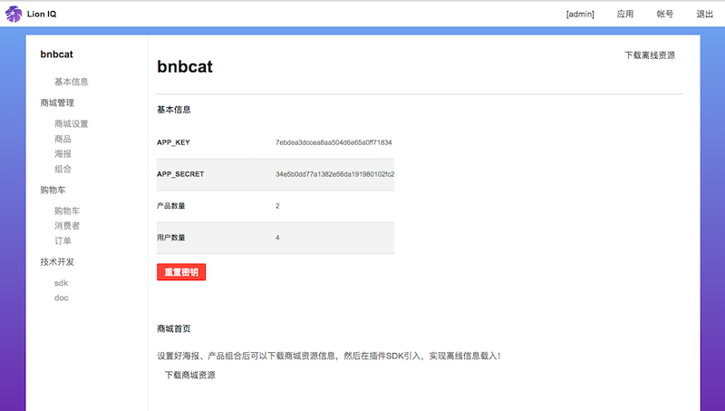
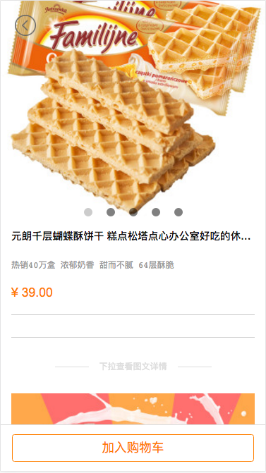
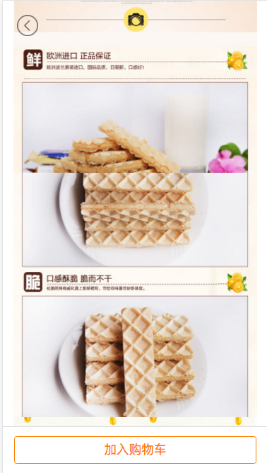
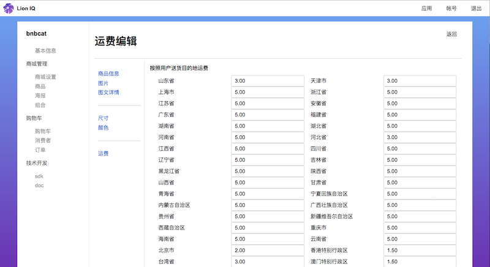

# 后台管理

### 获取密钥

进入应用后台界面后，菜单选择 [基本信息] 可以看到商城基本信息. 
请保密 `APP_KEY` 及 `APP_SECRET` ! 若需要重置的话，可以点击 [重置] 按钮

### 商城离线资源包

进入应用后台界面后，菜单选择 [基本信息] 可以看到商城基本信息. 
下面点击按钮 [下载商城资源] 保存为 `shop_data.json`. 这个文档包含商城首页的信息，若商城首页信息有改变可以再点击下载。

下载后拉进 Xcode 项目，之后根据引入指示载入离线商城信息，加快用户看到商城信息的体验. 

### 产品管理

后台菜单点击 [商品] 后可以看到所有商城的产品。点击右上角 [新增产品] 可以创建新产品，或是点击产品图片进行编辑。

#### 产品信息

- 产品名称
    + 商城页面显示的商品名称
- 描述
    + 产品详情页面显示的详细描述。建议把详细解释用 [图文详情] 文字＋图片丰富解释
- 价格
    + 产品价格
- 标签
    + 跟产品相关的关键词标签，用于商城搜索
- 上架
    + 产品上架才会在商城出现

#### 图片

产品图片，用来展示产品。在商城首页会出现封面图，其他图片会在产品详情页面轮播图展示。(封面图是第一张图片)

#### 图文详情

产品图文详情，用文字＋图片丰富的介绍产品给用户，让用户滑动了解产品。

#### 买家须知

每个产品可以设定 "买家须知" 例如: "全场包邮", "7天退换" 之类。 为了方便，可以到 [商场设置] 设定默认的买家须知信息。

#### 运费

产品运费按照送货省辖计算，运费按照单件算。

### 组合管理

(COMING SOON)

### 海报管理

(COMING SOON)